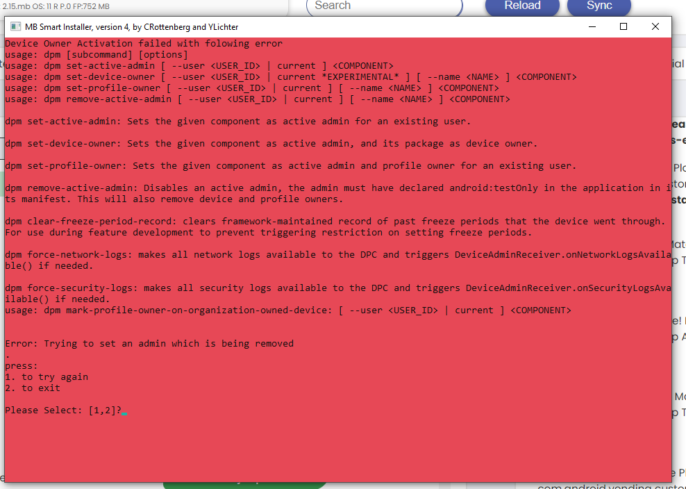
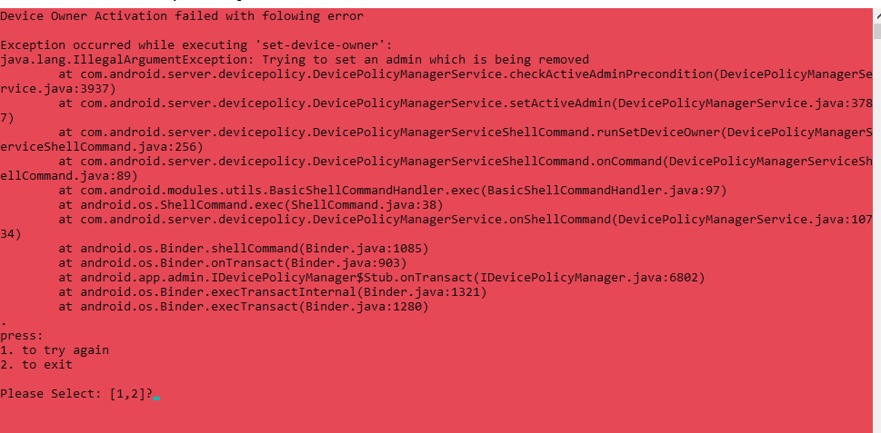
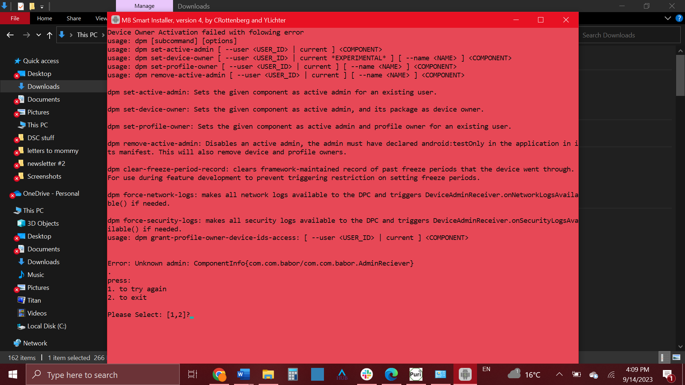
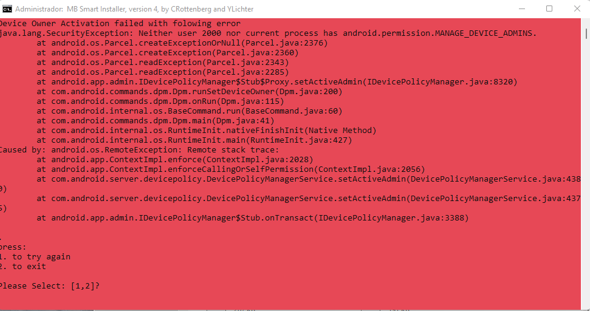
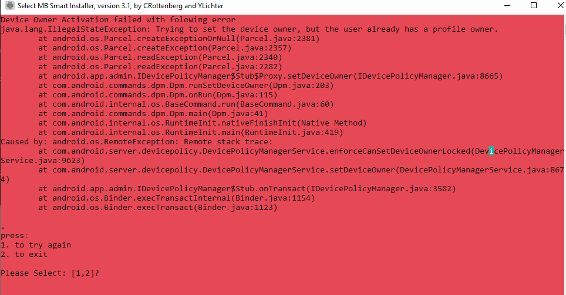

# MB Smart Android Insallation Troubleshooting:

## Known installer error messages:

- These installer errors:
  
  
  Indicates that you are trying to install the filter while the device owner that was present is currently being removed, and waiting a minute or two would be recommended.

- This installer error:
  
  Indicates that the device admin was not recognized, which could be caused by the app not being installed correctly or the admin service not being present in the system. Either way, the recommendation is to check for the presence of the admin in the device, and rerunning the installer if it is not present.
- This installer error:
  
  Has appeared only in chinese brand devices, like Xiaomi, and can be fixed by enabling the Secure USB Install setting in developer options. <!---TODO-->
- This installer error:
    
    Means that the device already has a profile owner. If no profile owner can be found on the device, then the issue lies with the ROM and the device should be deemed incompatible with MB Smart (just this one, other devices of the same model might have an unaffected ROM).
    This error is mostly found on Qin devices.
- Otherwise, _c_ ...
- These are placeholders for real troubleshooting steps, please excuse me while compiling them into a comprehensive list.
