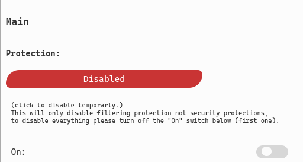
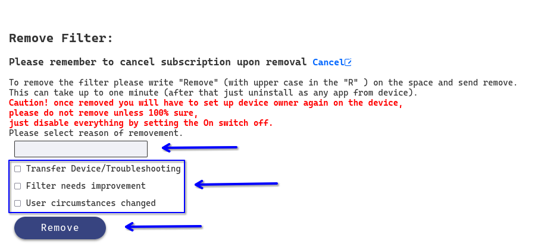

# Android Uninstallation Guide

## Step-by-step instructions

- Cancel the payment on the user's portal, unless the intent is to transfer into a new device.
- On the _Main_ tab of the user's portal, set _Protection_ to "Disabled" and the _On_ switch to 
the "off" position.

    

- In the section labeled _Remove Filter_ type "Remove" with a capital 'R' and select a reason for
removal, then press the button labeled "Remove".

    

- Afterwards, press the _Sync_ button on the top portion of the portal, and wait for the portal to
reload.
> [!Note]
> If the filter has been configured to not send notifications, or the device has been set up to
> not allow them, the notifications will not apear.
- The device should now receive a notification indicating that removal has started, but take notice
that this only removes the Device Owner from the device and not the app itself, its removal will be
the final step.
- Wait until the device gets a notification stating that removal has been completed, this can take
around 5 minutes.
- You can now attempt to uninstall the MB Smart app, this is best done from _Settings_ => _Apps_ =>
_MB Smart_ and pressing _Uninstall_. 
