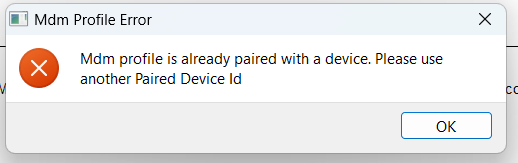

- If you see an error like 

    

`TAG-Supervisor-v3.exe` and `TAG-Supervisor-MDM-APP-V3.exe` need to be bypassed on the computer's 
filter.

- If you see an error like the following:
    
    

It means that the device ID already has a paired device (which means it is already installed on 
another device) or that _Enrollment Lock_ is enabled in the _Main_ tab of the portal.
